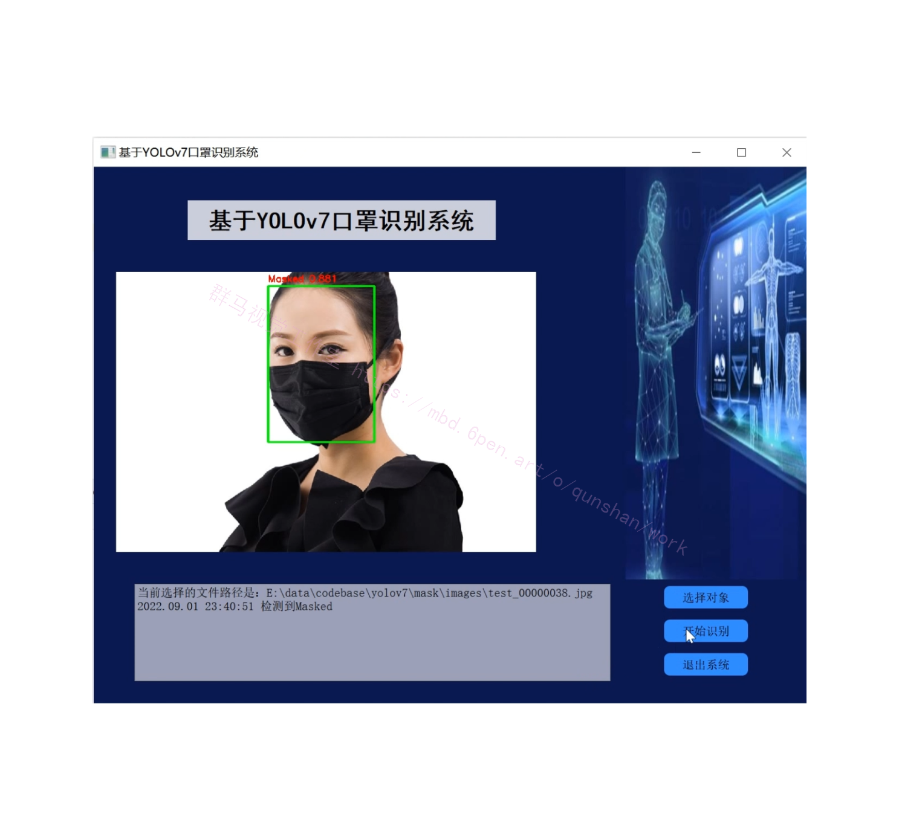
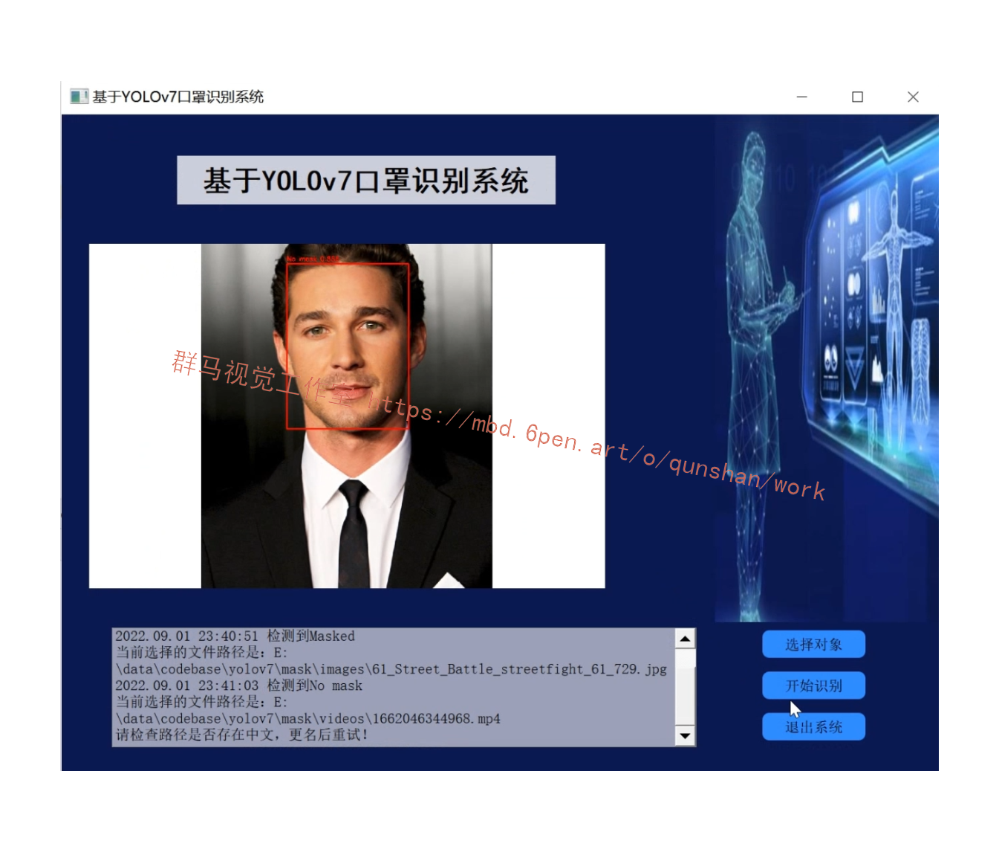
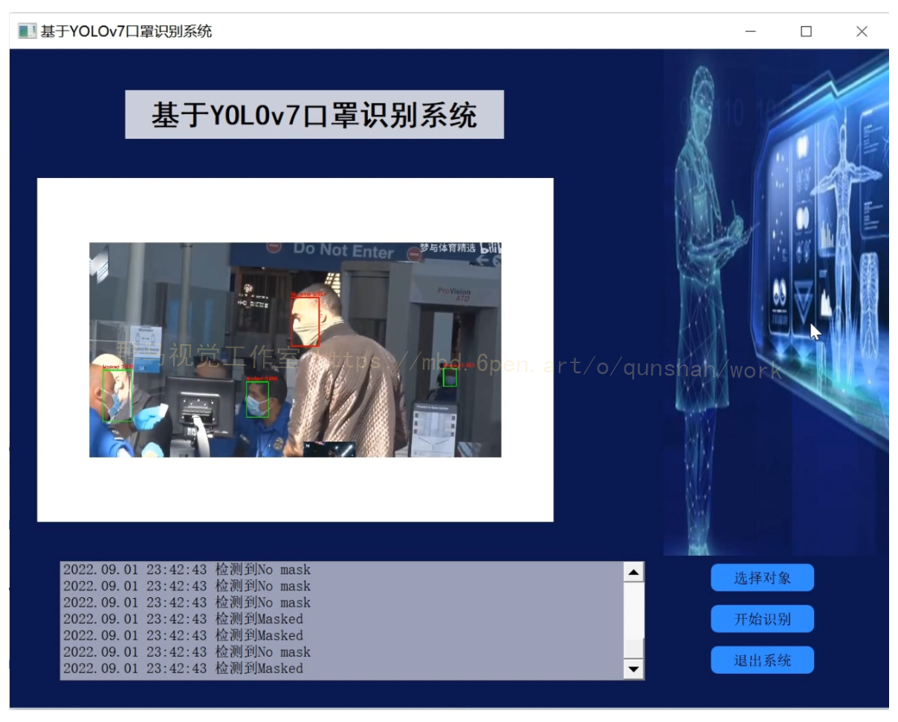
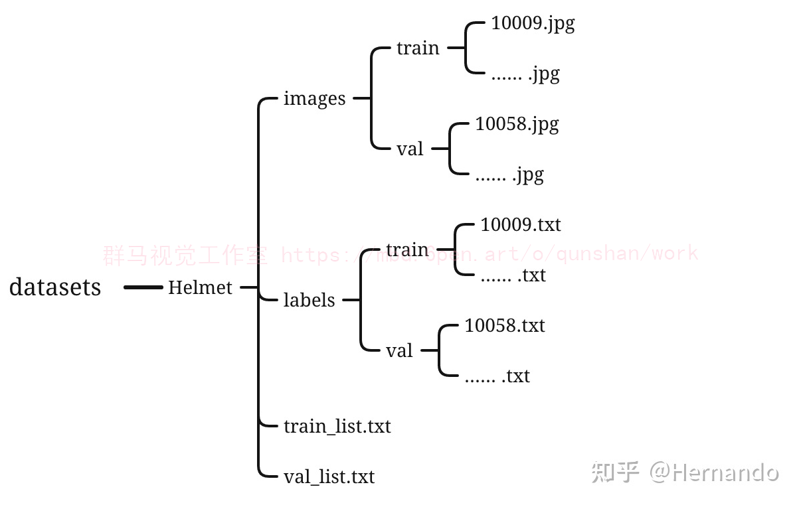
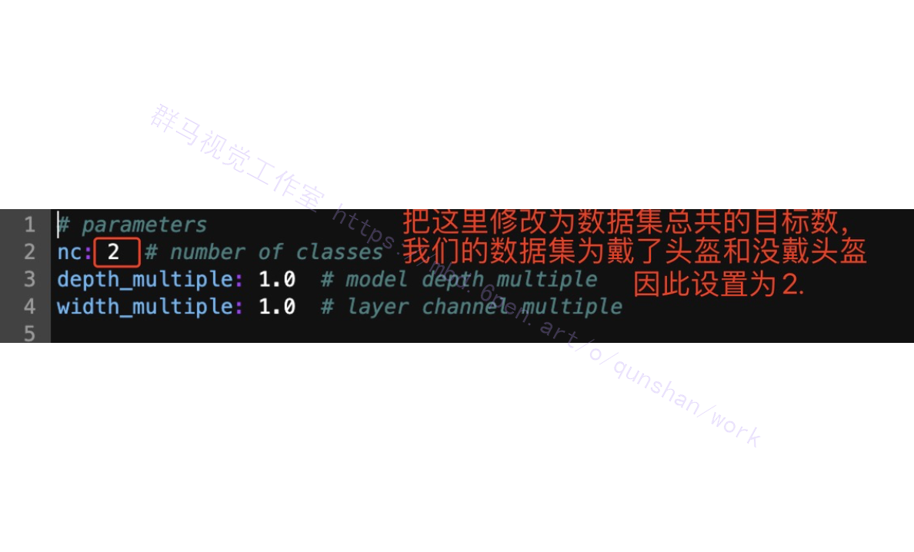
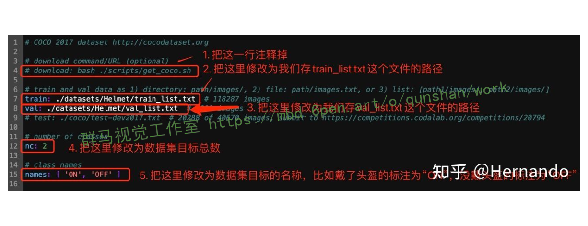

# 1.研究背景
为满足疫情时期的特殊需要,基于改进YOLOv7模型,设计一款应用于复杂场景的口罩佩戴识别检测系统。系统采用PyCharm集成开发环境,从网络上爬取1600张口罩佩戴相关的图片，在原始 k-means算法基础上加入聚类算法,获取与真实框之间的更高的先验框。在人机交互界面使用Qt组件设计,图像和模型数据加载使用开源OpenCV视觉库实现。口罩佩戴检测的核心算法使用目标检测算法中的YOLOv7训练并结合PyTorch框架实现。实验结果表明,系统能够实现多人场景下人群佩戴口罩状况的检测,在多人物以及实时检测场景中准确率有所提高,在使用和效果上都具有自身特有的优势。


# 2.图片识别





# 3.视频识别


# 4.视频演示
[[YOLOv7]基于YOLOv7的口罩识别系统(源码＆部署教程)_哔哩哔哩_bilibili](https://www.bilibili.com/video/BV1Ke41137xz/?vd_source=bc9aec86d164b67a7004b996143742dc)


# 5.准备YOLOv7格式数据集
如果不懂yolo格式数据集是什么样子的，建议[先学习一下该博客](https://afdian.net/item?plan_id=988690065fdd11ed83ea52540025c377)。大部分CVer都会推荐用labelImg进行数据的标注，我也不例外，推荐大家用labelImg进行数据标注。不过这里我不再详细介绍如何使用labelImg，网上有很多的教程。同时，标注数据需要用到图形交互界面，远程服务器就不太方便了，因此建议在本地电脑上标注好后再上传到服务器上。

这里假设我们已经得到标注好的yolo格式数据集，那么这个数据集将会按照如下的格式进行存放。

不过在这里面，train_list.txt和val_list.txt是后来我们要自己生成的，而不是labelImg生成的；其他的则是labelImg生成的。

接下来，就是生成 train_list.txt和val_list.txt。train_list.txt存放了所有训练图片的路径，val_list.txt则是存放了所有验证图片的路径，如下图所示，一行代表一个图片的路径。这两个文件的生成写个循环就可以了，不算难。

# 6.修改配置文件
[参考该博客的教程](https://mbd.pub/o/bread/Y5WUmJZq)，总共有两个文件需要配置，一个是/yolov7/cfg/training/yolov7.yaml，这个文件是有关模型的配置文件；一个是/yolov7/data/coco.yaml，这个是数据集的配置文件。

## 第一步，复制yolov7.yaml文件到相同的路径下，然后重命名，我们重命名为yolov7-Helmet.yaml。

## 第二步，打开yolov7-Helmet.yaml文件，进行如下图所示的修改，这里修改的地方只有一处，就是把nc修改为我们数据集的目标总数即可。然后保存。



## 第三步，复制coco.yaml文件到相同的路径下，然后重命名，我们命名为Helmet.yaml。

## 第四步，打开Helmet.yaml文件，进行如下所示的修改，需要修改的地方为5处。
第一处：把代码自动下载COCO数据集的命令注释掉，以防代码自动下载数据集占用内存；第二处：修改train的位置为train_list.txt的路径；第三处：修改val的位置为val_list.txt的路径；第四处：修改nc为数据集目标总数；第五处：修改names为数据集所有目标的名称。然后保存。



# 7.训练代码
```
import argparse
import logging
import math
import os
import random
import time
from copy import deepcopy
from pathlib import Path
from threading import Thread

import numpy as np
import torch.distributed as dist
import torch.nn as nn
import torch.nn.functional as F
import torch.optim as optim
import torch.optim.lr_scheduler as lr_scheduler
import torch.utils.data
import yaml
from torch.cuda import amp
from torch.nn.parallel import DistributedDataParallel as DDP
from torch.utils.tensorboard import SummaryWriter
from tqdm import tqdm

import test  # import test.py to get mAP after each epoch
from models.experimental import attempt_load
from models.yolo import Model
from utils.autoanchor import check_anchors
from utils.datasets import create_dataloader
from utils.general import labels_to_class_weights, increment_path, labels_to_image_weights, init_seeds, \
    fitness, strip_optimizer, get_latest_run, check_dataset, check_file, check_git_status, check_img_size, \
    check_requirements, print_mutation, set_logging, one_cycle, colorstr
from utils.google_utils import attempt_download
from utils.loss import ComputeLoss, ComputeLossOTA
from utils.plots import plot_images, plot_labels, plot_results, plot_evolution
from utils.torch_utils import ModelEMA, select_device, intersect_dicts, torch_distributed_zero_first, is_parallel
from utils.wandb_logging.wandb_utils import WandbLogger, check_wandb_resume

logger = logging.getLogger(__name__)


def train(hyp, opt, device, tb_writer=None):
    logger.info(colorstr('hyperparameters: ') + ', '.join(f'{k}={v}' for k, v in hyp.items()))
    save_dir, epochs, batch_size, total_batch_size, weights, rank, freeze = \
        Path(opt.save_dir), opt.epochs, opt.batch_size, opt.total_batch_size, opt.weights, opt.global_rank, opt.freeze

    # Directories
    wdir = save_dir / 'weights'
    wdir.mkdir(parents=True, exist_ok=True)  # make dir
    last = wdir / 'last.pt'
    best = wdir / 'best.pt'
    results_file = save_dir / 'results.txt'

    # Save run settings
    with open(save_dir / 'hyp.yaml', 'w') as f:
        yaml.dump(hyp, f, sort_keys=False)
    with open(save_dir / 'opt.yaml', 'w') as f:
        yaml.dump(vars(opt), f, sort_keys=False)

    # Configure
    plots = not opt.evolve  # create plots
    cuda = device.type != 'cpu'
    init_seeds(2 + rank)
    with open(opt.data) as f:
        data_dict = yaml.load(f, Loader=yaml.SafeLoader)  # data dict
    is_coco = opt.data.endswith('coco.yaml')

    # Logging- Doing this before checking the dataset. Might update data_dict
    loggers = {'wandb': None}  # loggers dict
    if rank in [-1, 0]:
        opt.hyp = hyp  # add hyperparameters
        run_id = torch.load(weights, map_location=device).get('wandb_id') if weights.endswith('.pt') and os.path.isfile(weights) else None
        wandb_logger = WandbLogger(opt, Path(opt.save_dir).stem, run_id, data_dict)
        loggers['wandb'] = wandb_logger.wandb
        data_dict = wandb_logger.data_dict
        if wandb_logger.wandb:
            weights, epochs, hyp = opt.weights, opt.epochs, opt.hyp  # WandbLogger might update weights, epochs if resuming

    nc = 1 if opt.single_cls else int(data_dict['nc'])  # number of classes
    names = ['item'] if opt.single_cls and len(data_dict['names']) != 1 else data_dict['names']  # class names
    assert len(names) == nc, '%g names found for nc=%g dataset in %s' % (len(names), nc, opt.data)  # check

    # Model
    pretrained = weights.endswith('.pt')
    if pretrained:
        with torch_distributed_zero_first(rank):
            attempt_download(weights)  # download if not found locally
        ckpt = torch.load(weights, map_location=device)  # load checkpoint
        model = Model(opt.cfg or ckpt['model'].yaml, ch=3, nc=nc, anchors=hyp.get('anchors')).to(device)  # create
        exclude = ['anchor'] if (opt.cfg or hyp.get('anchors')) and not opt.resume else []  # exclude keys
        state_dict = ckpt['model'].float().state_dict()  # to FP32
        state_dict = intersect_dicts(state_dict, model.state_dict(), exclude=exclude)  # intersect
        model.load_state_dict(state_dict, strict=False)  # load
        logger.info('Transferred %g/%g items from %s' % (len(state_dict), len(model.state_dict()), weights))  # report
    else:
        model = Model(opt.cfg, ch=3, nc=nc, anchors=hyp.get('anchors')).to(device)  # create
    with torch_distributed_zero_first(rank):
        check_dataset(data_dict)  # check
    train_path = data_dict['train']
    test_path = data_dict['val']

    # Freeze
    freeze = [f'model.{x}.' for x in (freeze if len(freeze) > 1 else range(freeze[0]))]  # parameter names to freeze (full or partial)
    for k, v in model.named_parameters():
        v.requires_grad = True  # train all layers
        if any(x in k for x in freeze):
            print('freezing %s' % k)
            v.requires_grad = False

    # Optimizer
    nbs = 64  # nominal batch size
    accumulate = max(round(nbs / total_batch_size), 1)  # accumulate loss before optimizing
    hyp['weight_decay'] *= total_batch_size * accumulate / nbs  # scale weight_decay
    logger.info(f"Scaled weight_decay = {hyp['weight_decay']}")

    pg0, pg1, pg2 = [], [], []  # optimizer parameter groups
    for k, v in model.named_modules():
        if hasattr(v, 'bias') and isinstance(v.bias, nn.Parameter):
            pg2.append(v.bias)  # biases
        if isinstance(v, nn.BatchNorm2d):
            pg0.append(v.weight)  # no decay
        elif hasattr(v, 'weight') and isinstance(v.weight, nn.Parameter):
            pg1.append(v.weight)  # apply decay
        if hasattr(v, 'im'):
            if hasattr(v.im, 'implicit'):           
                pg0.append(v.im.implicit)
            else:
                for iv in v.im:
                    pg0.append(iv.implicit)
        if hasattr(v, 'imc'):
            if hasattr(v.imc, 'implicit'):           
                pg0.append(v.imc.implicit)
            else:
                for iv in v.imc:
                    pg0.append(iv.implicit)
        if hasattr(v, 'imb'):
            if hasattr(v.imb, 'implicit'):           
                pg0.append(v.imb.implicit)
            else:
                for iv in v.imb:
                    pg0.append(iv.implicit)
        if hasattr(v, 'imo'):
            if hasattr(v.imo, 'implicit'):           
                pg0.append(v.imo.implicit)
            else:
                for iv in v.imo:
                    pg0.append(iv.implicit)
        if hasattr(v, 'ia'):
            if hasattr(v.ia, 'implicit'):           
                pg0.append(v.ia.implicit)
            else:
                for iv in v.ia:
                    pg0.append(iv.implicit)
        if hasattr(v, 'attn'):
            if hasattr(v.attn, 'logit_scale'):   
                pg0.append(v.attn.logit_scale)
            if hasattr(v.attn, 'q_bias'):   
                pg0.append(v.attn.q_bias)
            if hasattr(v.attn, 'v_bias'):  
                pg0.append(v.attn.v_bias)
            if hasattr(v.attn, 'relative_position_bias_table'):  
                pg0.append(v.attn.relative_position_bias_table)
        if hasattr(v, 'rbr_dense'):
            if hasattr(v.rbr_dense, 'weight_rbr_origin'):  
                pg0.append(v.rbr_dense.weight_rbr_origin)
            if hasattr(v.rbr_dense, 'weight_rbr_avg_conv'): 
                pg0.append(v.rbr_dense.weight_rbr_avg_conv)
            if hasattr(v.rbr_dense, 'weight_rbr_pfir_conv'):  
                pg0.append(v.rbr_dense.weight_rbr_pfir_conv)
            if hasattr(v.rbr_dense, 'weight_rbr_1x1_kxk_idconv1'): 
                pg0.append(v.rbr_dense.weight_rbr_1x1_kxk_idconv1)
            if hasattr(v.rbr_dense, 'weight_rbr_1x1_kxk_conv2'):   
                pg0.append(v.rbr_dense.weight_rbr_1x1_kxk_conv2)
            if hasattr(v.rbr_dense, 'weight_rbr_gconv_dw'):   
                pg0.append(v.rbr_dense.weight_rbr_gconv_dw)
            if hasattr(v.rbr_dense, 'weight_rbr_gconv_pw'):   
                pg0.append(v.rbr_dense.weight_rbr_gconv_pw)
            if hasattr(v.rbr_dense, 'vector'):   
                pg0.append(v.rbr_dense.vector)

    if opt.adam:
        optimizer = optim.Adam(pg0, lr=hyp['lr0'], betas=(hyp['momentum'], 0.999))  # adjust beta1 to momentum
    else:
        optimizer = optim.SGD(pg0, lr=hyp['lr0'], momentum=hyp['momentum'], nesterov=True)

    optimizer.add_param_group({'params': pg1, 'weight_decay': hyp['weight_decay']})  # add pg1 with weight_decay
    optimizer.add_param_group({'params': pg2})  # add pg2 (biases)
    logger.info('Optimizer groups: %g .bias, %g conv.weight, %g other' % (len(pg2), len(pg1), len(pg0)))
    del pg0, pg1, pg2

    # Scheduler https://arxiv.org/pdf/1812.01187.pdf
    # https://pytorch.org/docs/stable/_modules/torch/optim/lr_scheduler.html#OneCycleLR
    if opt.linear_lr:
        lf = lambda x: (1 - x / (epochs - 1)) * (1.0 - hyp['lrf']) + hyp['lrf']  # linear
    else:
        lf = one_cycle(1, hyp['lrf'], epochs)  # cosine 1->hyp['lrf']
    scheduler = lr_scheduler.LambdaLR(optimizer, lr_lambda=lf)
    # plot_lr_scheduler(optimizer, scheduler, epochs)

    # EMA
    ema = ModelEMA(model) if rank in [-1, 0] else None

    # Resume
    start_epoch, best_fitness = 0, 0.0
    if pretrained:
        # Optimizer
        if ckpt['optimizer'] is not None:
            optimizer.load_state_dict(ckpt['optimizer'])
            best_fitness = ckpt['best_fitness']

        # EMA
        if ema and ckpt.get('ema'):
            ema.ema.load_state_dict(ckpt['ema'].float().state_dict())
            ema.updates = ckpt['updates']

        # Results
        if ckpt.get('training_results') is not None:
            results_file.write_text(ckpt['training_results'])  # write results.txt

        # Epochs
        start_epoch = ckpt['epoch'] + 1
        if opt.resume:
            assert start_epoch > 0, '%s training to %g epochs is finished, nothing to resume.' % (weights, epochs)
        if epochs < start_epoch:
            logger.info('%s has been trained for %g epochs. Fine-tuning for %g additional epochs.' %
                        (weights, ckpt['epoch'], epochs))
            epochs += ckpt['epoch']  # finetune additional epochs

        del ckpt, state_dict

    # Image sizes
    gs = max(int(model.stride.max()), 32)  # grid size (max stride)
    nl = model.model[-1].nl  # number of detection layers (used for scaling hyp['obj'])
    imgsz, imgsz_test = [check_img_size(x, gs) for x in opt.img_size]  # verify imgsz are gs-multiples

    # DP mode
    if cuda and rank == -1 and torch.cuda.device_count() > 1:
        model = torch.nn.DataParallel(model)

    # SyncBatchNorm
    if opt.sync_bn and cuda and rank != -1:
        model = torch.nn.SyncBatchNorm.convert_sync_batchnorm(model).to(device)
        logger.info('Using SyncBatchNorm()')

    # Trainloader
    dataloader, dataset = create_dataloader(train_path, imgsz, batch_size, gs, opt,
                                            hyp=hyp, augment=True, cache=opt.cache_images, rect=opt.rect, rank=rank,
                                            world_size=opt.world_size, workers=opt.workers,
                                            image_weights=opt.image_weights, quad=opt.quad, prefix=colorstr('train: '))
    mlc = np.concatenate(dataset.labels, 0)[:, 0].max()  # max label class
    nb = len(dataloader)  # number of batches
    assert mlc < nc, 'Label class %g exceeds nc=%g in %s. Possible class labels are 0-%g' % (mlc, nc, opt.data, nc - 1)

    # Process 0
    if rank in [-1, 0]:
        testloader = create_dataloader(test_path, imgsz_test, batch_size * 2, gs, opt,  # testloader
                                       hyp=hyp, cache=opt.cache_images and not opt.notest, rect=True, rank=-1,
                                       world_size=opt.world_size, workers=opt.workers,
                                       pad=0.5, prefix=colorstr('val: '))[0]

        if not opt.resume:
            labels = np.concatenate(dataset.labels, 0)
            c = torch.tensor(labels[:, 0])  # classes
            # cf = torch.bincount(c.long(), minlength=nc) + 1.  # frequency
            # model._initialize_biases(cf.to(device))
            if plots:
                #plot_labels(labels, names, save_dir, loggers)
                if tb_writer:
                    tb_writer.add_histogram('classes', c, 0)

            # Anchors
            if not opt.noautoanchor:
                check_anchors(dataset, model=model, thr=hyp['anchor_t'], imgsz=imgsz)
            model.half().float()  # pre-reduce anchor precision

    # DDP mode
    if cuda and rank != -1:
        model = DDP(model, device_ids=[opt.local_rank], output_device=opt.local_rank,
                    # nn.MultiheadAttention incompatibility with DDP https://github.com/pytorch/pytorch/issues/26698
                    find_unused_parameters=any(isinstance(layer, nn.MultiheadAttention) for layer in model.modules()))

    # Model parameters
    hyp['box'] *= 3. / nl  # scale to layers
    hyp['cls'] *= nc / 80. * 3. / nl  # scale to classes and layers
    hyp['obj'] *= (imgsz / 640) ** 2 * 3. / nl  # scale to image size and layers
    hyp['label_smoothing'] = opt.label_smoothing
    model.nc = nc  # attach number of classes to model
    model.hyp = hyp  # attach hyperparameters to model
    model.gr = 1.0  # iou loss ratio (obj_loss = 1.0 or iou)
    model.class_weights = labels_to_class_weights(dataset.labels, nc).to(device) * nc  # attach class weights
    model.names = names

    # Start training
    t0 = time.time()
    nw = max(round(hyp['warmup_epochs'] * nb), 1000)  # number of warmup iterations, max(3 epochs, 1k iterations)
    # nw = min(nw, (epochs - start_epoch) / 2 * nb)  # limit warmup to < 1/2 of training
    maps = np.zeros(nc)  # mAP per class
    results = (0, 0, 0, 0, 0, 0, 0)  # P, R, mAP@.5, mAP@.5-.95, val_loss(box, obj, cls)
    scheduler.last_epoch = start_epoch - 1  # do not move
    scaler = amp.GradScaler(enabled=cuda)
    compute_loss_ota = ComputeLossOTA(model)  # init loss class
    compute_loss = ComputeLoss(model)  # init loss class
    logger.info(f'Image sizes {imgsz} train, {imgsz_test} test\n'
                f'Using {dataloader.num_workers} dataloader workers\n'
                f'Logging results to {save_dir}\n'
                f'Starting training for {epochs} epochs...')
    torch.save(model, wdir / 'init.pt')
    for epoch in range(start_epoch, epochs):  # epoch ------------------------------------------------------------------
        model.train()

        # Update image weights (optional)
        if opt.image_weights:
            # Generate indices
            if rank in [-1, 0]:
                cw = model.class_weights.cpu().numpy() * (1 - maps) ** 2 / nc  # class weights
                iw = labels_to_image_weights(dataset.labels, nc=nc, class_weights=cw)  # image weights
                dataset.indices = random.choices(range(dataset.n), weights=iw, k=dataset.n)  # rand weighted idx
            # Broadcast if DDP
            if rank != -1:
                indices = (torch.tensor(dataset.indices) if rank == 0 else torch.zeros(dataset.n)).int()
                dist.broadcast(indices, 0)
                if rank != 0:
                    dataset.indices = indices.cpu().numpy()

        # Update mosaic border
        # b = int(random.uniform(0.25 * imgsz, 0.75 * imgsz + gs) // gs * gs)
        # dataset.mosaic_border = [b - imgsz, -b]  # height, width borders

        mloss = torch.zeros(4, device=device)  # mean losses
        if rank != -1:
            dataloader.sampler.set_epoch(epoch)
        pbar = enumerate(dataloader)
        logger.info(('\n' + '%10s' * 8) % ('Epoch', 'gpu_mem', 'box', 'obj', 'cls', 'total', 'labels', 'img_size'))
        if rank in [-1, 0]:
            pbar = tqdm(pbar, total=nb)  # progress bar
        optimizer.zero_grad()
        for i, (imgs, targets, paths, _) in pbar:  # batch -------------------------------------------------------------
            ni = i + nb * epoch  # number integrated batches (since train start)
            imgs = imgs.to(device, non_blocking=True).float() / 255.0  # uint8 to float32, 0-255 to 0.0-1.0

            # Warmup
            if ni <= nw:
                xi = [0, nw]  # x interp
                # model.gr = np.interp(ni, xi, [0.0, 1.0])  # iou loss ratio (obj_loss = 1.0 or iou)
                accumulate = max(1, np.interp(ni, xi, [1, nbs / total_batch_size]).round())
                for j, x in enumerate(optimizer.param_groups):
                    # bias lr falls from 0.1 to lr0, all other lrs rise from 0.0 to lr0
                    x['lr'] = np.interp(ni, xi, [hyp['warmup_bias_lr'] if j == 2 else 0.0, x['initial_lr'] * lf(epoch)])
                    if 'momentum' in x:
                        x['momentum'] = np.interp(ni, xi, [hyp['warmup_momentum'], hyp['momentum']])

            # Multi-scale
            if opt.multi_scale:
                sz = random.randrange(imgsz * 0.5, imgsz * 1.5 + gs) // gs * gs  # size
                sf = sz / max(imgs.shape[2:])  # scale factor
                if sf != 1:
                    ns = [math.ceil(x * sf / gs) * gs for x in imgs.shape[2:]]  # new shape (stretched to gs-multiple)
                    imgs = F.interpolate(imgs, size=ns, mode='bilinear', align_corners=False)

            # Forward
            with amp.autocast(enabled=cuda):
                pred = model(imgs)  # forward
                if 'loss_ota' not in hyp or hyp['loss_ota'] == 1:
                    loss, loss_items = compute_loss_ota(pred, targets.to(device), imgs)  # loss scaled by batch_size
                else:
                    loss, loss_items = compute_loss(pred, targets.to(device))  # loss scaled by batch_size
                if rank != -1:
                    loss *= opt.world_size  # gradient averaged between devices in DDP mode
                if opt.quad:
                    loss *= 4.

            # Backward
            scaler.scale(loss).backward()

            # Optimize
            if ni % accumulate == 0:
                scaler.step(optimizer)  # optimizer.step
                scaler.update()
                optimizer.zero_grad()
                if ema:
                    ema.update(model)

            # Print
            if rank in [-1, 0]:
                mloss = (mloss * i + loss_items) / (i + 1)  # update mean losses
                mem = '%.3gG' % (torch.cuda.memory_reserved() / 1E9 if torch.cuda.is_available() else 0)  # (GB)
                s = ('%10s' * 2 + '%10.4g' * 6) % (
                    '%g/%g' % (epoch, epochs - 1), mem, *mloss, targets.shape[0], imgs.shape[-1])
                pbar.set_description(s)

                # Plot
                if plots and ni < 10:
                    f = save_dir / f'train_batch{ni}.jpg'  # filename
                    Thread(target=plot_images, args=(imgs, targets, paths, f), daemon=True).start()
                    # if tb_writer:
                    #     tb_writer.add_image(f, result, dataformats='HWC', global_step=epoch)
                    #     tb_writer.add_graph(torch.jit.trace(model, imgs, strict=False), [])  # add model graph
                elif plots and ni == 10 and wandb_logger.wandb:
                    wandb_logger.log({"Mosaics": [wandb_logger.wandb.Image(str(x), caption=x.name) for x in
                                                  save_dir.glob('train*.jpg') if x.exists()]})

            # end batch ------------------------------------------------------------------------------------------------
        # end epoch ----------------------------------------------------------------------------------------------------

        # Scheduler
        lr = [x['lr'] for x in optimizer.param_groups]  # for tensorboard
        scheduler.step()

        # DDP process 0 or single-GPU
        if rank in [-1, 0]:
            # mAP
            ema.update_attr(model, include=['yaml', 'nc', 'hyp', 'gr', 'names', 'stride', 'class_weights'])
            final_epoch = epoch + 1 == epochs
            if not opt.notest or final_epoch:  # Calculate mAP
                wandb_logger.current_epoch = epoch + 1
                results, maps, times = test.test(data_dict,
                                                 batch_size=batch_size * 2,
                                                 imgsz=imgsz_test,
                                                 model=ema.ema,
                                                 single_cls=opt.single_cls,
                                                 dataloader=testloader,
                                                 save_dir=save_dir,
                                                 verbose=nc < 50 and final_epoch,
                                                 plots=plots and final_epoch,
                                                 wandb_logger=wandb_logger,
                                                 compute_loss=compute_loss,
                                                 is_coco=is_coco)

            # Write
            with open(results_file, 'a') as f:
                f.write(s + '%10.4g' * 7 % results + '\n')  # append metrics, val_loss
            if len(opt.name) and opt.bucket:
                os.system('gsutil cp %s gs://%s/results/results%s.txt' % (results_file, opt.bucket, opt.name))

            # Log
            tags = ['train/box_loss', 'train/obj_loss', 'train/cls_loss',  # train loss
                    'metrics/precision', 'metrics/recall', 'metrics/mAP_0.5', 'metrics/mAP_0.5:0.95',
                    'val/box_loss', 'val/obj_loss', 'val/cls_loss',  # val loss
                    'x/lr0', 'x/lr1', 'x/lr2']  # params
            for x, tag in zip(list(mloss[:-1]) + list(results) + lr, tags):
                if tb_writer:
                    tb_writer.add_scalar(tag, x, epoch)  # tensorboard
                if wandb_logger.wandb:
                    wandb_logger.log({tag: x})  # W&B

            # Update best mAP
            fi = fitness(np.array(results).reshape(1, -1))  # weighted combination of [P, R, mAP@.5, mAP@.5-.95]
            if fi > best_fitness:
                best_fitness = fi
            wandb_logger.end_epoch(best_result=best_fitness == fi)

            # Save model
            if (not opt.nosave) or (final_epoch and not opt.evolve):  # if save
                ckpt = {'epoch': epoch,
                        'best_fitness': best_fitness,
                        'training_results': results_file.read_text(),
                        'model': deepcopy(model.module if is_parallel(model) else model).half(),
                        'ema': deepcopy(ema.ema).half(),
                        'updates': ema.updates,
                        'optimizer': optimizer.state_dict(),
                        'wandb_id': wandb_logger.wandb_run.id if wandb_logger.wandb else None}

                # Save last, best and delete
                torch.save(ckpt, last)
                if best_fitness == fi:
                    torch.save(ckpt, best)
                if (best_fitness == fi) and (epoch >= 200):
                    torch.save(ckpt, wdir / 'best_{:03d}.pt'.format(epoch))
                if epoch == 0:
                    torch.save(ckpt, wdir / 'epoch_{:03d}.pt'.format(epoch))
                elif ((epoch+1) % 25) == 0:
                    torch.save(ckpt, wdir / 'epoch_{:03d}.pt'.format(epoch))
                elif epoch >= (epochs-5):
                    torch.save(ckpt, wdir / 'epoch_{:03d}.pt'.format(epoch))
                if wandb_logger.wandb:
                    if ((epoch + 1) % opt.save_period == 0 and not final_epoch) and opt.save_period != -1:
                        wandb_logger.log_model(
                            last.parent, opt, epoch, fi, best_model=best_fitness == fi)
                del ckpt

        # end epoch ----------------------------------------------------------------------------------------------------
    # end training
    if rank in [-1, 0]:
        # Plots
        if plots:
            plot_results(save_dir=save_dir)  # save as results.png
            if wandb_logger.wandb:
                files = ['results.png', 'confusion_matrix.png', *[f'{x}_curve.png' for x in ('F1', 'PR', 'P', 'R')]]
                wandb_logger.log({"Results": [wandb_logger.wandb.Image(str(save_dir / f), caption=f) for f in files
                                              if (save_dir / f).exists()]})
        # Test best.pt
        logger.info('%g epochs completed in %.3f hours.\n' % (epoch - start_epoch + 1, (time.time() - t0) / 3600))
        if opt.data.endswith('coco.yaml') and nc == 80:  # if COCO
            for m in (last, best) if best.exists() else (last):  # speed, mAP tests
                results, _, _ = test.test(opt.data,
                                          batch_size=batch_size * 2,
                                          imgsz=imgsz_test,
                                          conf_thres=0.001,
                                          iou_thres=0.7,
                                          model=attempt_load(m, device).half(),
                                          single_cls=opt.single_cls,
                                          dataloader=testloader,
                                          save_dir=save_dir,
                                          save_json=True,
                                          plots=False,
                                          is_coco=is_coco)

        # Strip optimizers
        final = best if best.exists() else last  # final model
        for f in last, best:
            if f.exists():
                strip_optimizer(f)  # strip optimizers
        if opt.bucket:
            os.system(f'gsutil cp {final} gs://{opt.bucket}/weights')  # upload
        if wandb_logger.wandb and not opt.evolve:  # Log the stripped model
            wandb_logger.wandb.log_artifact(str(final), type='model',
                                            name='run_' + wandb_logger.wandb_run.id + '_model',
                                            aliases=['last', 'best', 'stripped'])
        wandb_logger.finish_run()
    else:
        dist.destroy_process_group()
    torch.cuda.empty_cache()
    return results


if __name__ == '__main__':
    parser = argparse.ArgumentParser()
    parser.add_argument('--weights', type=str, default='yolov7.pt', help='initial weights path')
    parser.add_argument('--cfg', type=str, default='cfg/training/yolov7.yaml', help='model.yaml path')
    parser.add_argument('--data', type=str, default='data/coco.yaml', help='data.yaml path')
    parser.add_argument('--hyp', type=str, default='data/hyp.scratch.p5.yaml', help='hyperparameters path')
    parser.add_argument('--epochs', type=int, default=300)
    parser.add_argument('--batch-size', type=int, default=4, help='total batch size for all GPUs')
    parser.add_argument('--img-size', nargs='+', type=int, default=[640, 640], help='[train, test] image sizes')
    parser.add_argument('--rect', action='store_true', help='rectangular training')
    parser.add_argument('--resume', nargs='?', const=True, default=False, help='resume most recent training')
    parser.add_argument('--nosave', action='store_true', help='only save final checkpoint')
    parser.add_argument('--notest', action='store_true', help='only test final epoch')
    parser.add_argument('--noautoanchor', action='store_true', help='disable autoanchor check')
    parser.add_argument('--evolve', action='store_true', help='evolve hyperparameters')
    parser.add_argument('--bucket', type=str, default='', help='gsutil bucket')
    parser.add_argument('--cache-images', action='store_true', help='cache images for faster training')
    parser.add_argument('--image-weights', action='store_true', help='use weighted image selection for training')
    parser.add_argument('--device', default='0', help='cuda device, i.e. 0 or 0,1,2,3 or cpu')
    parser.add_argument('--multi-scale', action='store_true', help='vary img-size +/- 50%%')
    parser.add_argument('--single-cls', action='store_true', help='train multi-class data as single-class')
    parser.add_argument('--adam', action='store_true', help='use torch.optim.Adam() optimizer')
    parser.add_argument('--sync-bn', action='store_true', help='use SyncBatchNorm, only available in DDP mode')
    parser.add_argument('--local_rank', type=int, default=-1, help='DDP parameter, do not modify')
    parser.add_argument('--workers', type=int, default=0, help='maximum number of dataloader workers')
    parser.add_argument('--project', default='runs/train', help='save to project/name')
    parser.add_argument('--entity', default=None, help='W&B entity')
    parser.add_argument('--name', default='exp', help='save to project/name')
    parser.add_argument('--exist-ok', action='store_true', help='existing project/name ok, do not increment')
    parser.add_argument('--quad', action='store_true', help='quad dataloader')
    parser.add_argument('--linear-lr', action='store_true', help='linear LR')
    parser.add_argument('--label-smoothing', type=float, default=0.0, help='Label smoothing epsilon')
    parser.add_argument('--upload_dataset', action='store_true', help='Upload dataset as W&B artifact table')
    parser.add_argument('--bbox_interval', type=int, default=-1, help='Set bounding-box image logging interval for W&B')
    parser.add_argument('--save_period', type=int, default=-1, help='Log model after every "save_period" epoch')
    parser.add_argument('--artifact_alias', type=str, default="latest", help='version of dataset artifact to be used')
    parser.add_argument('--freeze', nargs='+', type=int, default=[0], help='Freeze layers: backbone of yolov7=50, first3=0 1 2')
    opt = parser.parse_args()

    # Set DDP variables
    opt.world_size = int(os.environ['WORLD_SIZE']) if 'WORLD_SIZE' in os.environ else 1
    opt.global_rank = int(os.environ['RANK']) if 'RANK' in os.environ else -1
    set_logging(opt.global_rank)
    #if opt.global_rank in [-1, 0]:
    #    check_git_status()
    #    check_requirements()

    # Resume
    wandb_run = check_wandb_resume(opt)
    if opt.resume and not wandb_run:  # resume an interrupted run
        ckpt = opt.resume if isinstance(opt.resume, str) else get_latest_run()  # specified or most recent path
        assert os.path.isfile(ckpt), 'ERROR: --resume checkpoint does not exist'
        apriori = opt.global_rank, opt.local_rank
        with open(Path(ckpt).parent.parent / 'opt.yaml') as f:
            opt = argparse.Namespace(**yaml.load(f, Loader=yaml.SafeLoader))  # replace
        opt.cfg, opt.weights, opt.resume, opt.batch_size, opt.global_rank, opt.local_rank = '', ckpt, True, opt.total_batch_size, *apriori  # reinstate
        logger.info('Resuming training from %s' % ckpt)
    else:
        # opt.hyp = opt.hyp or ('hyp.finetune.yaml' if opt.weights else 'hyp.scratch.yaml')
        opt.data, opt.cfg, opt.hyp = check_file(opt.data), check_file(opt.cfg), check_file(opt.hyp)  # check files
        assert len(opt.cfg) or len(opt.weights), 'either --cfg or --weights must be specified'
        opt.img_size.extend([opt.img_size[-1]] * (2 - len(opt.img_size)))  # extend to 2 sizes (train, test)
        opt.name = 'evolve' if opt.evolve else opt.name
        opt.save_dir = increment_path(Path(opt.project) / opt.name, exist_ok=opt.exist_ok | opt.evolve)  # increment run

    # DDP mode
    opt.total_batch_size = opt.batch_size
    device = select_device(opt.device, batch_size=opt.batch_size)
    if opt.local_rank != -1:
        assert torch.cuda.device_count() > opt.local_rank
        torch.cuda.set_device(opt.local_rank)
        device = torch.device('cuda', opt.local_rank)
        dist.init_process_group(backend='nccl', init_method='env://')  # distributed backend
        assert opt.batch_size % opt.world_size == 0, '--batch-size must be multiple of CUDA device count'
        opt.batch_size = opt.total_batch_size // opt.world_size

    # Hyperparameters
    with open(opt.hyp) as f:
        hyp = yaml.load(f, Loader=yaml.SafeLoader)  # load hyps

    # Train
    logger.info(opt)
    if not opt.evolve:
        tb_writer = None  # init loggers
        if opt.global_rank in [-1, 0]:
            prefix = colorstr('tensorboard: ')
            logger.info(f"{prefix}Start with 'tensorboard --logdir {opt.project}', view at http://localhost:6006/")
            tb_writer = SummaryWriter(opt.save_dir)  # Tensorboard
        train(hyp, opt, device, tb_writer)

    # Evolve hyperparameters (optional)
    else:
        # Hyperparameter evolution metadata (mutation scale 0-1, lower_limit, upper_limit)
        meta = {'lr0': (1, 1e-5, 1e-1),  # initial learning rate (SGD=1E-2, Adam=1E-3)
                'lrf': (1, 0.01, 1.0),  # final OneCycleLR learning rate (lr0 * lrf)
                'momentum': (0.3, 0.6, 0.98),  # SGD momentum/Adam beta1
                'weight_decay': (1, 0.0, 0.001),  # optimizer weight decay
                'warmup_epochs': (1, 0.0, 5.0),  # warmup epochs (fractions ok)
                'warmup_momentum': (1, 0.0, 0.95),  # warmup initial momentum
                'warmup_bias_lr': (1, 0.0, 0.2),  # warmup initial bias lr
                'box': (1, 0.02, 0.2),  # box loss gain
                'cls': (1, 0.2, 4.0),  # cls loss gain
                'cls_pw': (1, 0.5, 2.0),  # cls BCELoss positive_weight
                'obj': (1, 0.2, 4.0),  # obj loss gain (scale with pixels)
                'obj_pw': (1, 0.5, 2.0),  # obj BCELoss positive_weight
                'iou_t': (0, 0.1, 0.7),  # IoU training threshold
                'anchor_t': (1, 2.0, 8.0),  # anchor-multiple threshold
                'anchors': (2, 2.0, 10.0),  # anchors per output grid (0 to ignore)
                'fl_gamma': (0, 0.0, 2.0),  # focal loss gamma (efficientDet default gamma=1.5)
                'hsv_h': (1, 0.0, 0.1),  # image HSV-Hue augmentation (fraction)
                'hsv_s': (1, 0.0, 0.9),  # image HSV-Saturation augmentation (fraction)
                'hsv_v': (1, 0.0, 0.9),  # image HSV-Value augmentation (fraction)
                'degrees': (1, 0.0, 45.0),  # image rotation (+/- deg)
                'translate': (1, 0.0, 0.9),  # image translation (+/- fraction)
                'scale': (1, 0.0, 0.9),  # image scale (+/- gain)
                'shear': (1, 0.0, 10.0),  # image shear (+/- deg)
                'perspective': (0, 0.0, 0.001),  # image perspective (+/- fraction), range 0-0.001
                'flipud': (1, 0.0, 1.0),  # image flip up-down (probability)
                'fliplr': (0, 0.0, 1.0),  # image flip left-right (probability)
                'mosaic': (1, 0.0, 1.0),  # image mixup (probability)
                'mixup': (1, 0.0, 1.0),   # image mixup (probability)
                'copy_paste': (1, 0.0, 1.0),  # segment copy-paste (probability)
                'paste_in': (1, 0.0, 1.0)}    # segment copy-paste (probability)
        
        with open(opt.hyp, errors='ignore') as f:
            hyp = yaml.safe_load(f)  # load hyps dict
            if 'anchors' not in hyp:  # anchors commented in hyp.yaml
                hyp['anchors'] = 3
                
        assert opt.local_rank == -1, 'DDP mode not implemented for --evolve'
        opt.notest, opt.nosave = True, True  # only test/save final epoch
        # ei = [isinstance(x, (int, float)) for x in hyp.values()]  # evolvable indices
        yaml_file = Path(opt.save_dir) / 'hyp_evolved.yaml'  # save best result here
        if opt.bucket:
            os.system('gsutil cp gs://%s/evolve.txt .' % opt.bucket)  # download evolve.txt if exists

        for _ in range(300):  # generations to evolve
            if Path('evolve.txt').exists():  # if evolve.txt exists: select best hyps and mutate
                # Select parent(s)
                parent = 'single'  # parent selection method: 'single' or 'weighted'
                x = np.loadtxt('evolve.txt', ndmin=2)
                n = min(5, len(x))  # number of previous results to consider
                x = x[np.argsort(-fitness(x))][:n]  # top n mutations
                w = fitness(x) - fitness(x).min()  # weights
                if parent == 'single' or len(x) == 1:
                    # x = x[random.randint(0, n - 1)]  # random selection
                    x = x[random.choices(range(n), weights=w)[0]]  # weighted selection
                elif parent == 'weighted':
                    x = (x * w.reshape(n, 1)).sum(0) / w.sum()  # weighted combination

                # Mutate
                mp, s = 0.8, 0.2  # mutation probability, sigma
                npr = np.random
                npr.seed(int(time.time()))
                g = np.array([x[0] for x in meta.values()])  # gains 0-1
                ng = len(meta)
                v = np.ones(ng)
                while all(v == 1):  # mutate until a change occurs (prevent duplicates)
                    v = (g * (npr.random(ng) < mp) * npr.randn(ng) * npr.random() * s + 1).clip(0.3, 3.0)
                for i, k in enumerate(hyp.keys()):  # plt.hist(v.ravel(), 300)
                    hyp[k] = float(x[i + 7] * v[i])  # mutate

            # Constrain to limits
            for k, v in meta.items():
                hyp[k] = max(hyp[k], v[1])  # lower limit
                hyp[k] = min(hyp[k], v[2])  # upper limit
                hyp[k] = round(hyp[k], 5)  # significant digits

            # Train mutation
            results = train(hyp.copy(), opt, device)

            # Write mutation results
            print_mutation(hyp.copy(), results, yaml_file, opt.bucket)

        # Plot results
        plot_evolution(yaml_file)
        print(f'Hyperparameter evolution complete. Best results saved as: {yaml_file}\n'
              f'Command to train a new model with these hyperparameters: $ python train.py --hyp {yaml_file}')
```
# 8.UI界面的编写＆系统的整合
```
class Thread_1(QThread):  # 线程1
    def __init__(self,info1):
        super().__init__()
        self.info1=info1
        self.run2(self.info1)

    def run2(self, info1):
        result = []
        result = det_yolov7(info1)


class Ui_MainWindow(object):
    def setupUi(self, MainWindow):
        MainWindow.setObjectName("MainWindow")
        MainWindow.resize(1280, 960)
        MainWindow.setStyleSheet("background-image: url(\"./template/carui.png\")")
        self.centralwidget = QtWidgets.QWidget(MainWindow)
        self.centralwidget.setObjectName("centralwidget")
        self.label = QtWidgets.QLabel(self.centralwidget)
        self.label.setGeometry(QtCore.QRect(168, 60, 551, 71))
        self.label.setAutoFillBackground(False)
        self.label.setStyleSheet("")
        self.label.setFrameShadow(QtWidgets.QFrame.Plain)
        self.label.setAlignment(QtCore.Qt.AlignCenter)
        self.label.setObjectName("label")
        self.label.setStyleSheet("font-size:42px;font-weight:bold;font-family:SimHei;background:rgba(255,255,255,0);")
        self.label_2 = QtWidgets.QLabel(self.centralwidget)
        self.label_2.setGeometry(QtCore.QRect(40, 188, 751, 501))
        self.label_2.setStyleSheet("background:rgba(255,255,255,1);")
        self.label_2.setAlignment(QtCore.Qt.AlignCenter)
        self.label_2.setObjectName("label_2")
        self.textBrowser = QtWidgets.QTextBrowser(self.centralwidget)
        self.textBrowser.setGeometry(QtCore.QRect(73, 746, 851, 174))
        self.textBrowser.setStyleSheet("background:rgba(0,0,0,0);")
        self.textBrowser.setObjectName("textBrowser")
        self.pushButton = QtWidgets.QPushButton(self.centralwidget)
        self.pushButton.setGeometry(QtCore.QRect(1020, 750, 150, 40))
        self.pushButton.setStyleSheet("background:rgba(53,142,255,1);border-radius:10px;padding:2px 4px;")
        self.pushButton.setObjectName("pushButton")
        self.pushButton_2 = QtWidgets.QPushButton(self.centralwidget)
        self.pushButton_2.setGeometry(QtCore.QRect(1020, 810, 150, 40))
        self.pushButton_2.setStyleSheet("background:rgba(53,142,255,1);border-radius:10px;padding:2px 4px;")
        self.pushButton_2.setObjectName("pushButton_2")
        self.pushButton_3 = QtWidgets.QPushButton(self.centralwidget)
        self.pushButton_3.setGeometry(QtCore.QRect(1020, 870, 150, 40))
        self.pushButton_3.setStyleSheet("background:rgba(53,142,255,1);border-radius:10px;padding:2px 4px;")
        self.pushButton_3.setObjectName("pushButton_2")
        MainWindow.setCentralWidget(self.centralwidget)

        self.retranslateUi(MainWindow)
        QtCore.QMetaObject.connectSlotsByName(MainWindow)

    def retranslateUi(self, MainWindow):
        _translate = QtCore.QCoreApplication.translate
        MainWindow.setWindowTitle(_translate("MainWindow", "基于YOLOv7口罩识别系统"))
        self.label.setText(_translate("MainWindow", "基于YOLOv7口罩识别系统"))
        self.label_2.setText(_translate("MainWindow", "请添加对象，注意路径不要存在中文"))
        self.pushButton.setText(_translate("MainWindow", "选择对象"))
        self.pushButton_2.setText(_translate("MainWindow", "开始识别"))
        self.pushButton_3.setText(_translate("MainWindow", "退出系统"))

        # 点击文本框绑定槽事件
        self.pushButton.clicked.connect(self.openfile)
        self.pushButton_2.clicked.connect(self.click_1)
        self.pushButton_3.clicked.connect(self.handleCalc3)

    def openfile(self):
        global sname, filepath
        fname = QFileDialog()
        fname.setAcceptMode(QFileDialog.AcceptOpen)
        fname, _ = fname.getOpenFileName()
        if fname == '':
            return
        filepath = os.path.normpath(fname)
        sname = filepath.split(os.sep)
        ui.printf("当前选择的文件路径是：%s" % filepath)
        try:
            show = cv2.imread(filepath)
            ui.showimg(show)
        except:
            ui.printf('请检查路径是否存在中文，更名后重试！')


    def handleCalc3(self):
        os._exit(0)

    def printf(self,text):
        self.textBrowser.append(text)
        self.cursor = self.textBrowser.textCursor()
        self.textBrowser.moveCursor(self.cursor.End)
        QtWidgets.QApplication.processEvents()

    def showimg(self,img):
        global vid
        img2 = cv2.cvtColor(img, cv2.COLOR_BGR2RGB)

        _image = QtGui.QImage(img2[:], img2.shape[1], img2.shape[0], img2.shape[1] * 3,
                              QtGui.QImage.Format_RGB888)
        n_width = _image.width()
        n_height = _image.height()
        if n_width / 500 >= n_height / 400:
            ratio = n_width / 700
        else:
            ratio = n_height / 700
        new_width = int(n_width / ratio)
        new_height = int(n_height / ratio)
        new_img = _image.scaled(new_width, new_height, Qt.KeepAspectRatio)
        self.label_2.setPixmap(QPixmap.fromImage(new_img))

    def click_1(self):
        global filepath
        try:
            self.thread_1.quit()
        except:
            pass
        self.thread_1 = Thread_1(filepath)  # 创建线程
        self.thread_1.wait()
        self.thread_1.start()  # 开始线程


if __name__ == "__main__":
    app = QtWidgets.QApplication(sys.argv)
    MainWindow = QtWidgets.QMainWindow()
    ui = Ui_MainWindow()
    ui.setupUi(MainWindow)
    MainWindow.show()
    sys.exit(app.exec_())
```

# 9.系统整合
下图[完整源码&环境部署视频教程&自定义UI界面](https://s.xiaocichang.com/s/476cda)

参考博客[《\[YOLOv7\]基于YOLOv7的口罩识别系统(源码＆部署教程)》](https://mbd.pub/o/qunma/work)


# 10.参考文献:
***
[1]肖博健,万烂军,陈俊权.采用YOLOV5模型的口罩佩戴识别研究[J].福建电脑.2021,(3).35-37.DOI:10.16707/j.cnki.fjpc.2021.03.009.
[2]董艳花,张树美,赵俊莉.有遮挡人脸识别方法综述[J].计算机工程与应用.2020,(9).1-12.DOI:10.3778/j.issn.1002-8331.2001-0029.
[3]肖俊杰.基于YOLOv3和YCrCb的人脸口罩检测与规范佩戴识别[J].软件.2020,(7).164-169.DOI:10.3969/j.issn.1003-6970.2020.07.033.
[4]刘振宇,姜雨濛.基于模板匹配的遮挡工件识别方法[J].计算机应用研究.2020,(S2).392-394,397.
[5]王明沂.局部遮挡下的人脸识别方法研究[D].2020
[6]高雷.基于深度学习的人脸识别与应用研究[D].2020
[7]Xiaoming Jiang,Xiaoming Jiang,Fugui Xiang,等.YOLOv3_Slim for Face Mask Recognition[J].Journal of Physics: Conference Series.2021,1771(1).012002 (8pp).DOI:10.1088/1742-6596/1771/1/012002.
[8]Guanhao Yang,Wei Feng,Jintao Jin,等.Face Mask Recognition System with YOLOV5 Based on Image Recognition[C].


---
#### 如果您需要更详细的【源码和环境部署教程】，除了通过【系统整合】小节的链接获取之外，还可以通过邮箱以下途径获取:
#### 1.请先在GitHub上为该项目点赞（Star），编辑一封邮件，附上点赞的截图、项目的中文描述概述（About）以及您的用途需求，发送到我们的邮箱
#### sharecode@yeah.net
#### 2.我们收到邮件后会定期根据邮件的接收顺序将【完整源码和环境部署教程】发送到您的邮箱。
#### 【免责声明】本文来源于用户投稿，如果侵犯任何第三方的合法权益，可通过邮箱联系删除。